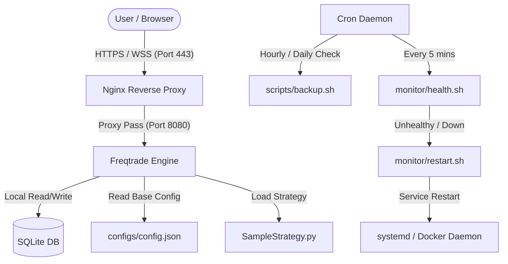

# Hardened Freqtrade Trading Bot Server
### Google Cloud Platform Free Tier Production-Grade Deployment

This repository contains a fully automated, hardened, and reproducible deployment configuration for the open-source **Freqtrade** trading bot. It is optimized to run on a Google Cloud Platform (GCP) **Free Tier** virtual machine.

---

## Architecture Overview



---

## Deployment Guide

### Phase 1: Provisioning the GCP Free Tier VM

Run the following command using the Google Cloud Shell or `gcloud` CLI tool locally to create your Free Tier eligible instance.

```bash
gcloud compute instances create freqtrade-bot \
    --zone=us-central1-a \
    --machine-type=e2-micro \
    --image-family=ubuntu-2404-lts-amd64 \
    --image-project=ubuntu-os-cloud \
    --boot-disk-size=30GB \
    --boot-disk-type=pd-standard \
    "--tags=http-server,https-server" \
    --metadata=enable-oslogin=TRUE
```

> [!IMPORTANT]
> **Free Tier Rules:**
> - Region must be `us-central1` (Iowa), `us-east1` (South Carolina), or `us-west1` (Oregon).
> - Machine type must be `e2-micro`.
> - Total boot disk space must not exceed 30 GB standard persistent disk.

#### Firewall Configuration
Ensure Google Cloud allows ingress traffic on TCP ports `22` (SSH), `80` (HTTP), and `443` (HTTPS) to the instance. You can create rules using the GCP Console or CLI:
```bash
gcloud compute firewall-rules create allow-http-https \
    "--allow=tcp:80,tcp:443" \
    "--target-tags=http-server,https-server" \
    --description="Allow port 80 and 443 ingress for Freqtrade Nginx reverse proxy"
```

---

### Phase 2: Installing and Hardening

1. **SSH into the VM**:
   Ensure you have configured SSH keys in your GCP metadata or OS Login.
   ```bash
   gcloud compute ssh freqtrade-bot --zone=us-central1-a
   ```

2. **Clone / Upload Project files**:
   Place the project files in `/home/freqtrade/freqtrade-server`.

3. **Run Automated Setup**:
   Execute the setup script with root privileges. It will automatically handle swap allocation, package installations, SSH hardening, UFW firewall configurations, fail2ban setup, Docker Engine, and systemd service registration.
   ```bash
   chmod +x scripts/setup.sh
   sudo ./scripts/setup.sh
   ```

4. **Verify Running State**:
   Confirm Freqtrade and Nginx containers are running:
   ```bash
   sudo systemctl status freqtrade.service
   sudo docker compose ps
   ```

---

## Server Hardening Details

- **Automatic Security Updates**: Enabled via `unattended-upgrades`.
- **System Firewall (UFW)**: Configured to drop all incoming packets except on ports 22 (SSH), 80 (HTTP), and 443 (HTTPS).
- **Intrusion Prevention**: `fail2ban` monitors `sshd` auth logs and bans malicious IPs for 1 hour.
- **2GB Swap Allocation**: Configured swap on disk to prevent Freqtrade database writes or startup from triggering Out-Of-Memory (OOM) killer on the 1GB RAM VM.
- **SSH Access Restrictions**: Passwords disabled. Only keys allowed. Root password login blocked.
- **Process Isolation**: Containers run under the non-root `freqtrade` deployment user.

---

## Backup Guide

### Automated Backup
The setup script registers a cron job that runs `scripts/backup.sh` daily.
- Backup content: Database (`user_data/tradesv3.sqlite`), configurations (`configs/`), custom strategies (`user_data/strategies/`), and environmental configurations (`.env`).
- Database consistency: Utilizes SQLite's native `.backup` command to perform hot-backups while Freqtrade is running.
- Retention: Kept for 7 days. Older backups are automatically deleted to save persistent disk space.

### Manual Backup
To trigger a manual backup:
```bash
/home/freqtrade/freqtrade-server/scripts/backup.sh
```
Backups are placed as compressed tarballs in `backups/`.

---

## Recovery & Restore Guide

If the server fails or database corruption occurs, you can restore state from one of the backups.

1. Locate the backup tarball inside the `backups/` directory (e.g., `freqtrade_backup_20260706_120000.tar.gz`).
2. Run the recovery script as root, passing the backup file path:
   ```bash
   sudo ./scripts/restore.sh ./backups/freqtrade_backup_20260706_120000.tar.gz
   ```
The script will stop the bot, clear current settings, overwrite with the backup contents, reset secure ownerships, and automatically restart Freqtrade.

---

## Monitoring & Auto-Reboot Recovery

### Scripts Overview (located in `monitor/`)
1. **`health.sh`**:
   - Queries Freqtrade API `/api/v1/ping` with local basic credentials.
   - Audits CPU, Memory, and Disk usage.
   - If the bot is unresponsive or down, it automatically calls `restart.sh` and records the restart in `logs/health.log`.
2. **`status.sh`**:
   - Prints current system health, Docker container states, bot software version, and trade stats (e.g., profit/loss).
3. **`restart.sh`**:
   - Restarts Freqtrade using `systemctl restart freqtrade`.

### Setup Cron Checks
To check health every 5 minutes, run `crontab -e` as `freqtrade` user and append:
```cron
*/5 * * * * /home/freqtrade/freqtrade-server/monitor/health.sh >/dev/null 2>&1
```

---

## Upgrade Guide

To pull the latest Freqtrade Docker image and restart the bot:
```bash
/home/freqtrade/freqtrade-server/scripts/upgrade.sh
```
This preserves your database, strategies, and configs.

---

## Future Integrations Stubs

This project is prepared to become the execution engine of a larger trading system. Placeholder integration stubs are available in the `scripts/integrations/` directory:

1. **REST API Client (`api_client.py`)**: Demonstrates programmatic authentication and bot command execution (buy/sell/status).
2. **Webhook Signal Receiver (`webhook_receiver.py`)**: Runs a server listening for custom webhook alerts (e.g. from TradingView) and translating them to Freqtrade API actions.
3. **Execution Adapter (`execution_adapter.py`)**: Risk check engine executing orders onto the bot.
4. **Event Publisher (`event_publisher.py`)**: Polling daemon emitting events like `TRADE_OPEN` and `TRADE_CLOSE` to external message brokers.
5. **Signal Receiver (`signal_receiver.py`)**: Parses raw external text feeds into standard formats.
6. **Dashboard Stub (`dashboard_stub.html`)**: Beautiful glassmorphism dark-theme HTML control center UI mockup.
