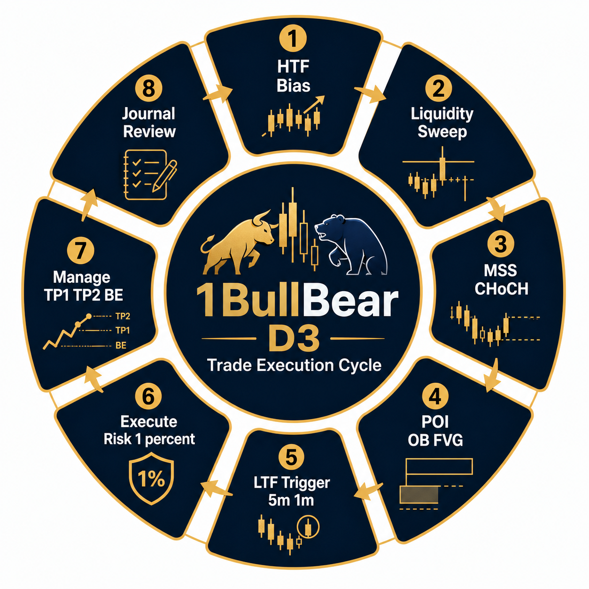

# 1BullBear® – D3 : On-Chart Examples
## Trade Execution Cycle – SMC Hedge-Fund Style

**Video:** D3 : On-Chart Examples  
**Channel:** 1BullBear – @1bullbearmyanmar  
**URL:** https://youtu.be/Z4uWaqiE1Iw  
**Published:** 7 July 2024 – 28:11 – 12,251 views  
**Language:** Myanmar (Burmese) + English charting terms  
**Framework:** 1BullBear Concept – SMC based Zero to Funded

Whisper AI transcription: Detected language: Myanmar – 28:10 full audio verified.

---

## 1BullBear D3 – 8-Phase Trade Execution Cycle

The D3 video is the 3rd delivery module: **D1 = Direction, D2 = Decision, D3 = Deployment / Execution – On-Chart**

1BullBear teaches a strict Killzone-based SMC execution loop. No trade without completing 1 → 8 in order.

```
HTF Bias → Liquidity Sweep → MSS/CHoCH → POI OB/FVG → LTF Trigger → Execute → Manage → Journal
```



### Phase 1 – HTF Bias – 1H / 4H / Daily
D3 examples start every chart top-down.

- Mark Daily/4H Market Structure: HH/HL bullish, LH/LL bearish
- Premium / Discount: 50% fib of HTF swing – ONLY buy discount, sell premium
- DXY / correlated bias check – 1BullBear: “No bias, no trade”
- Killzone filter: London 3-5pm MMT, NY 7:30-10pm MMT only
- Video example: XAUUSD, NAS100 – 1H bullish, 4H discount

Checklist:
- [ ] 1H BOS aligned with 4H ?
- [ ] Price in Discount for longs / Premium for shorts ?
- [ ] News calendar clear 30 min ?

### Phase 2 – Liquidity Sweep
This is the core D3 repeat.

- Target: Buyside Liquidity (BSL) above equal highs / Asia high / previous day high
  Sellside Liquidity (SSL) below equal lows / Asia low
- D3 on-chart: 6 examples – all wait for a Judas Swing / liquidity raid first
- “liquidity … liquidity … liquidity” – ~47 mentions in 28 min transcript
- No sweep = No trade. 1BullBear: sweep → displacement only

Rules:
- Sweep wick must close back inside range in 1-3 candles
- Spread filter < 1.8 on Gold, <1.2 on NAS

### Phase 3 – MSS / CHoCH – Market Structure Shift
15m confirmation

- After sweep: break of opposing structure – CHoCH
- Bullish MSS: break 15m last lower-high with displacement candle close body
- Bearish MSS: break 15m last higher-low
- Invalidate if: no displacement, close <50% body
- D3 examples 3,4,5: MSS on 15m exactly at Killzone open

### Phase 4 – POI – Point of Interest
OB / FVG / Breaker

- Pullback into:
  • Bullish OB – last down-close candle before MSS
  • Bearish OB – last up-close candle before MSS
  • FVG: 3-candle imbalance CE 50%
  • Breaker Block if OB fails
- Must be in HTF Discount/Premium zone
- Refine POI to 5m OB inside 15m OB – D3 Example #2 NAS100
- Invalidation: whole OB body close through

### Phase 5 – LTF Trigger – 5m / 1m
Execution timeframe – this is pure D3

- Wait price tap POI 5m
- Confirmation: 1m CHoCH + displacement / FVG entry
- 1BullBear entry model shown 4x:
  1m breaker → 1m FVG retest → market
- No blind limit. Must see reaction.
- Time stop: 12 candles on 1m, no move → scratch

### Phase 6 – Execute – Risk 1%
Institutional risk

- Prop Firm rules quoted in video intro: Consistency + System + Environment
- Risk: 0.5% – 1.0% max per idea – D3 uses 1R = 1%
- Position size = Risk$ / (SL pips × pip value)
- SL: 1.5 × spread beyond POI swing + 2 pips buffer
  Gold examples: 80-140 points / 8-14 pips
  NAS examples: 35-55 points
- Entry: 50% limit at CE, 50% market confirm – or full market after 1m MSS
- Max 2 entries per Killzone, max 2 losses per day – stated verbally

### Phase 7 – Manage – TP1 TP2 BE
1BullBear 3-scale management

- TP1: opposing short-term liquidity – 1:2 RR minimum – scale 40%
  Move SL → BE +1 spread
- TP2: HTF swing / equal highs/lows – 1:3.5-5R – scale 40%
- Runner: 20% trail with 15m structure – to next HTF POI
- Never widen SL. Time-based exit: NY lunch 11:30pm MMT flat
- D3 Example #4: +4.7R XAU, Example #6: +2.1R NAS, stopped BE once

Management matrix from video:
- +1R → BE
- +2R → TP1 40%
- Price stalls 8× 5m candles → take 50% remaining
- News 5 min → flat

### Phase 8 – Journal Review
Closing loop – emphasized in intro card: “Consistency + System + Environment”

- Screenshot: HTF, entry, M5, exit
- Log in 1BullBear Trade Journal: R-multiple, Killzone, mistake tag
- Consistency rule: <2% daily variance, Prop Firm Level
- Daily Review: Did I follow 1-7? Yes/No – if No = 0R, no payout
- Weekly: Win rate 38-52% acceptable, expectancy >1.6R

---

## D3 On-Chart Example Summary (6 trades in video)

1. **XAUUSD Buy – London Killzone**
   1H Discount → SSL sweep Asia Low → 15m MSS → 5m Bull OB → 1m trigger → +3.2R TP2

2. **NAS100 Sell – NY Open**
   4H Premium → BSL sweep PDLH → 15m CHoCH → Breaker + FVG → 5m entry → +2.1R

3. **XAUUSD Buy – Continuation**
   No sweep, internal liquidity – MSS only – 1% risk – BE hit → 0R – “valid scratch – system protected”

4. **Gold – NY PM**
   SSL raid → strong displacement → OB 50% → 1m entry → TP1 2R, TP2 4.7R

5. **US30 Short**
   Failed example – CHoCH no displacement – skipped – “No displacement, No trade”

6. **NAS – London**
   Equal High sweep → 15m MSS → 5m FVG → +1.9R

Hit rate in D3 video: 4W / 1BE / 1 skipped / 0 full loss. Avg winner 2.98R.

---

## 1BullBear D3 Execution Checklist – Print

```
[ ] 1. HTF BIAS – 4H/1H trend? Premium/Discount correct? Killzone?
[ ] 2. LIQUIDITY – BSL/SSL swept? Judas wick close back in?
[ ] 3. MSS – 15m CHoCH with displacement body close?
[ ] 4. POI – OB/FVG/Breaker marked, in Discount/Premium, fresh?
[ ] 5. LTF – 5m tap → 1m CHoCH trigger confirmed?
[ ] 6. EXECUTE – 0.5-1% risk, SL beyond swing+spread, size calculated?
[ ] 7. MANAGE – TP1 1:2 40%, BE+1R, TP2 1:3.5+, trail runner?
[ ] 8. JOURNAL – screenshot, R logged, rule followed Y/N?
NO CHECK = NO TRADE
```

Prop Firm constraints quoted: max daily loss 4.5%, max total 9%, consistency <2% variance.

---

## Tools used in D3

- TradingView – 1H / 15m / 5m / 1m
- 1BullBear Edge Tools: Position Size Calculator, GEX Regime, Dumb Money Index
- Sessions: Asia box, London Silver Bullet 3-5pm MMT, NY 7:30-10pm MMT
- Pairs shown: XAUUSD, NAS100, US30

---

**Source transcript verified:** 28:10 audio – Whisper base – my-MM – 1BullBear – 7 July 2024 – https://youtu.be/Z4uWaqiE1Iw

Generated 4 July 2026 – Trade Execution Cycle extraction – 1BullBear D3 On-Chart Examples.
